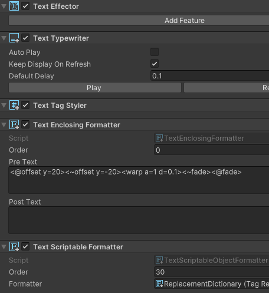
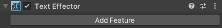
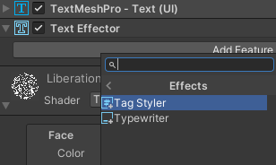
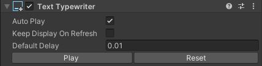
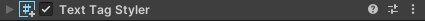

# Text Effects
Text Effects は、Unityのテキスト(TMP)に対して、
置換、アニメーションなどの効果を手軽に適用することを可能にするライブラリです。



## インストール

1. `Window > Package Manager` から、PackageManagerを開く
2. 左上の「+」ボタンをクリックし、`Add package from git URL`を選択
3. 以下のURLを入力する

```
https://github.com/gameshalico/TextEffects.git
```

## スタートガイド
### 1. Textの作成
まず、TextMeshProのTextを作成してください。

> Unity 2023.2未満の場合は、別途TextMeshProをインストールする必要があります。

### 2. TextEffectorの付与

`TextEffector` コンポ―ネントを Text の追加された GameObject にアタッチします。


### 3. 各種効果 (TextEffectorFeature) の適用

`TextEffector` の Add Features ボタンから、適用したい効果を選択します。通常のAddComponentから追加することも可能です。



組み込みの `TextEffectorFeature` は以下を参照してください。

[TextEffectorFeature](#TextEffectorFeature)
- [Formatter](#Formatter)
- [Typewriter](#Typewriter)
- [Formatter](#Formatter)


## TextEffectorFeature
`TextEffector` を通じて適用できる効果のことを総称して `TextEffectorFeature` と呼びます。

これらのコンポーネントは `ITextAnimationEffect` , `ITextFormatter` のインターフェースを通じて `TextEffector` を拡張し、
テキストに対して様々な効果を適用することができます。

主要な `TextEffectorFeature` は以下の通りです。

| 機能 | 概要 |
| --- | --- |
| Formatter | タグとして解釈される前にテキストの置換、整形を行います。 |
| TagStyler | StyleTagを元にテキストに恒常的なスタイルを適用します。 |
| Typewriter | DisplayTagを元に、テキストを1文字ずつ表示します。 |

## Formatter
`Formatter` は、テキストを解釈する前に、置換、整形を行う `TextEffectorFeature` です。

実装済みのFormatterは以下の通りです。

- **EnclosingFormatter** : テキストの前後に任意の文字列を追加します。
- **ScriptableObjectFormatter** : ScriptableFormatterを元に、テキストを整形します。
    - **GroupScriptableFormatter** : 複数のScriptableFormatterをまとめて適用します。
    - **ReplaceScriptableFormatter** : 任意の文字列を置換します。
    - **TagReplaceScriptableFormatter** : タグを置換します。


## Typewriter


`Typewriter` は、`DisplayTag`を元に、テキストを1文字ずつ表示する `TextEffectorFeature` です。
使用する際は、表示、非表示アニメーションを指定する必要があります。

UniTaskを導入している場合はUniTaskを、導入していない場合はTaskを使用して再生します。

即座に表示したい場合は、`<@fade d=0>`のように、`duration`を0に設定してください。

TextTypewriterコンポーネントを通じて、再生や停止、一時停止などの操作が可能です。

- `Play(string text)`関数で、指定したテキストを再生します。
- `PlayScript()`関数で、現状のテキストを再生します。

尚、それぞれ非同期版の`PlayAsync`, `PlayScriptAsync`が用意されています。
その他の操作は、`TextTypewriter`を参照してください。

| 変数 | 説明 |
| --- | --- |
| **AutoPlay** | テキストの生成時、自動的に再生を開始するかどうか |
| **KeepDisplayOnRefresh** | テキストを再生成しても、再生を止めず文字の表示情報を保持するかどうか |
| **DefaultDelay** | 各文字の初期表示遅延 |


### DisplayTag
`DisplayTag`を用いて、テキストの表示、非表示アニメーションを指定できます。

`DisplayTag`には、@XXX、~XXXのように、一つのアニメーションタイプに対して二種類のタグが存在します。

@XXX は表示アニメーション、~XXX は非表示アニメーションを指定します。

| タグ | 効果 | 引数 |
| --- | --- | --- |
| **\<@fade/~fade\>** | フェードイン/アウト | d |
| **\<@scale/~scale\>** | 拡大縮小 | a,d |
| **\<@offset/~offset\>** | 移動 | x,y,d |
| **\<@roffset/~roffset\>** | ランダム位置移動 | a,d |
| **\<@rotate/~rotate\>** | 回転 | a,d |

| 引数 | 意味 | 説明 |
| --- | --- | --- |
| **a** | amplitude | 振幅/効果の強さ |
| **d** | duration | 持続時間 |
| **x** | x | x方向の移動量 |
| **y** | y | y方向の移動量 |

### その他のタグ
`Typewriter`には、再生時に特定の効果を適用するためのタグが用意されています。

`IScriptModifier`, `IScriptListener`というインターフェースを通じて独自に拡張することも可能です。

| タグ | 効果 | 引数 |
| --- | --- | --- |
| **\<d/delay\>** | 範囲内、もしくは次の文字に表示遅延を加算 | ※1 |
| **\<dr/delay\>** | 表示遅延に倍率を掛ける | ※1 |
| **\<evt/event\>** | イベントを発行する | ※2 |


※1 引数は、`<d=0.1>`のように指定します。

※2 引数は、`IReadonlyDictionary<string, string>` の形でそのまま渡されます。


## TagStyler


`TagStyler`は、`StyleTag`を元に、テキストに恒常的なスタイルを適用する`TextEffectorFeature`です。

実装済みの`StyleTag`は以下の通りです。

### StyleTag
| タグ | 効果 | 引数 |
| --- | --- | --- |
| **\<wave\>** | 波打たせる | a,f,s |
| **\<wiggle\>** | 文字毎に固有な方向に動かす | a,f,s |
| **\<swing\>** | 中心を起点に回転する | a,f,s |
| **\<pend\>** | 上を起点に回転する | a,f,s |
| **\<pulse\>** | 文字を拡大する | a,f,s |
| **\<bounce\>** | 文字を跳ねさせる | a,f,s |
| **\<shake\>** | 振動させる | a,d |
| **\<warp\>** | 文字を歪ませる | a,d |
| **\<rainb\>** | 虹色に変化させる | f,s,sat,val |

タグの引数の意味は、以下の通りです。

| 引数 | 意味 | 説明 |
| --- | --- | --- |
| **a** | amplitude | 振幅/効果の強さ |
| **f** | frequency | 周波数 |
| **s** | step | 文字毎の差分 |
| **d** | delay | 更新遅延 |
| **sat** | saturation | 彩度 |
| **val** | value | 明度 |
